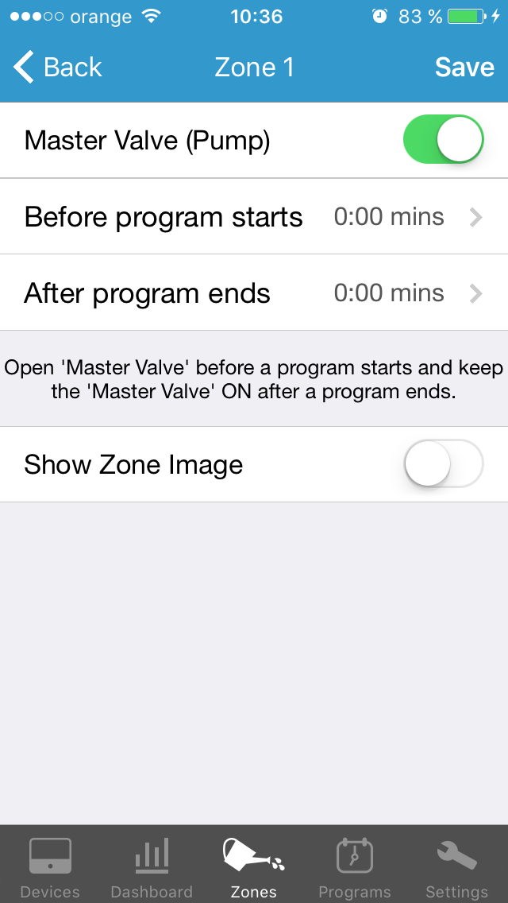
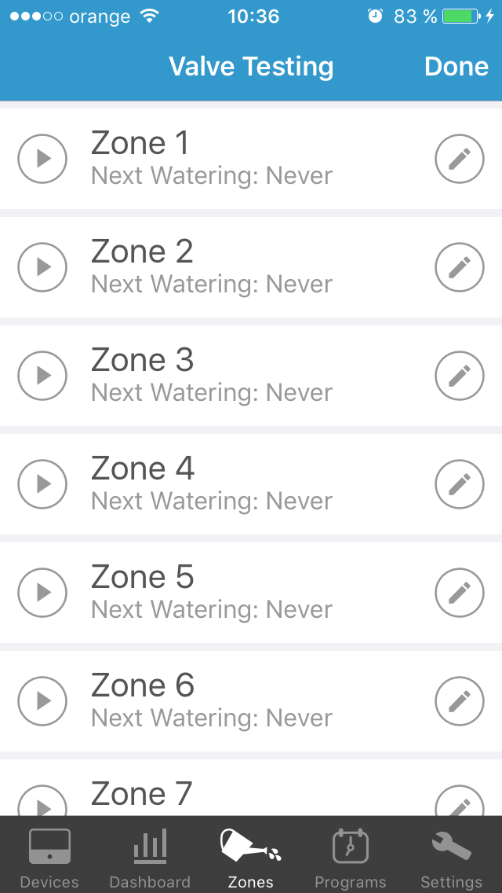
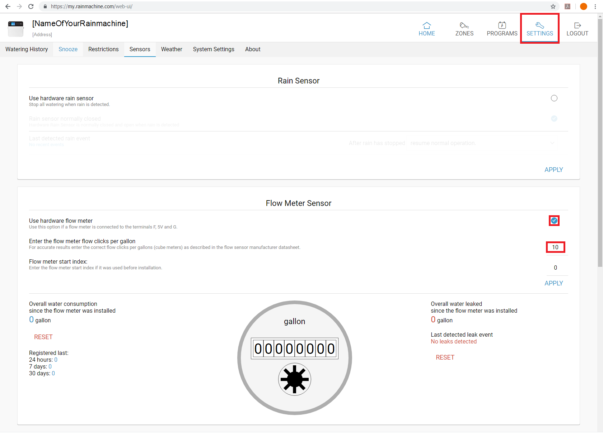
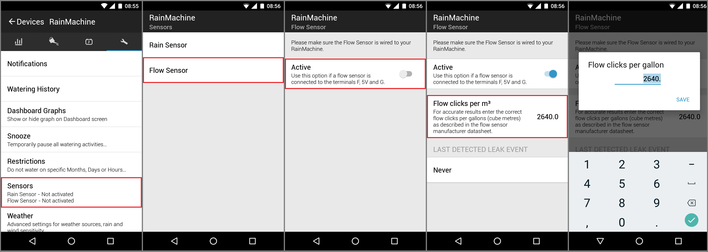

# App / control — RainMachine HD-16 (app, WebUI, cloud)

The hardware lives in `controller.md`; this file is the **software** — the watering logic and how you
drive it. `setup.yaml` records **three control paths** to the same controller:

- **Touchscreen** on the unit itself.
- **Mobile app over home Wi-Fi** (phone on the same network — local/Direct access).
- **Mobile app via the RainMachine cloud** (away from home, over the internet).

The WebUI at **my.rainmachine.com** (username + password) exposes the same settings and is often the
easiest place to do detailed setup. **Units differ by region:** the US app talks in gallons, the EU
app in **m³** — this homeowner is in the Netherlands, so expect m³ and clicks-per-m³.

## Weather-adaptive watering and programs

The RainMachine doesn't just run a fixed timer — it **adjusts each zone's run length daily** from
weather data (temperature, wind, rain, humidity, sun) using evapotranspiration (ET), and may **skip
watering entirely** when rain is forecast. This is why no wired rain sensor is fitted here: rain-skip
comes from the forecast over Wi-Fi.

To water automatically you need at least one **program**: give it a name, a **frequency** (how often),
a **start time**, and a **base watering duration** per zone (a typical summer day) — either *Custom*
(you set it) or *Suggested* (calculated from the zone's soil/plant/sun/location). Each zone then
flexes around that base.

Useful program properties:
- **Adjust duration based on weather** — daily ET adjustment on/off.
- **Cycle and Soak** — splits the run into shorter cycles with soak gaps so soil absorbs water instead
  of running off (good on slopes / clay).
- **Delay between zones** — gap between consecutive zones; useful where pressure or a tank needs to
  recover. (This system already has a 5 s pump-start delay set on the hardware side — see
  `controller.md`.)

## Zone properties and the master-valve toggle

Per zone you can set **soil type, slope and exposure** (these drive Field Capacity and the evaporation
rate), **vegetation type** (e.g. vegetables need roughly double the water of xeriscape), and
**sprinkler head type** (sets the zone's flow rate). These feed the *Suggested* durations and the ET
maths.

**Master valve / pump:** a zone can be re-assigned as the master-valve output via the **Master Valve
(Pump)** toggle in that zone's settings, with optional **"before program starts"** and **"after
program ends"** lead/lag times (keep the MV on a bit early/late). On this system that output drives the
**PSR-22 pump start relay**, not an inline valve — see `controller.md`.

## Manual watering and valve testing

From **Zones**, tap a zone's play button and pick a duration to run it on demand (default 5 min); this
**doesn't affect scheduled programs**. The **Valve Testing** list runs each zone in turn — the quickest
way to confirm a valve actually opens, and the first move in the zone-won't-turn-on check below.

## Restrictions and watering limits

- **Restrictions** — block watering on chosen Days / Months / Hours.
- **Rain restriction** (per program) — don't water if forecast rain exceeds a set amount.
- **Snooze** — temporary skip for N days.
- **Freeze Protect** — stop watering when the forecast low drops below a threshold (so heads don't ice).
- **Hot Days** — cap (or lift) watering as a percentage on hot days; default cap 100 %.
- **Sensitivity** — global responsiveness to forecast rain/wind; 0 removes that factor. Leave default
  unless you have a clear reason.
- **Field Capacity** — how much water the soil holds after draining (set from Soil Type, in mm). The
  controller tracks **Available Water** (rises with rain, drawn down by ET) and won't water a zone that
  still has enough — which is a common reason a zone "didn't come on" (see below).

## Sensor software setup

Wiring and the one-sensor-at-a-time / 2 Hz limits are in `controller.md`; this is the *software* you
set after wiring one in. **Neither sensor is fitted on this system** (deliberate, per `setup.yaml`) —
reference only.

**Flow meter** (WebUI: Settings → Sensors → *Flow Meter Sensor*; or in the app under Sensors → Flow
Sensor):
- Tick **Use hardware flow meter**.
- Enter the **clicks per m³** (US app: clicks per gallon) from the meter's datasheet — the EU app field
  reads "Flow clicks per m³" (e.g. 2640). Wrong number → wrong volumes.
- Optionally set the **start index** (the meter's reading at install) so the counter begins there.
- Two **RESET** buttons: the left one zeroes **overall water consumption**; the right one clears the
  **last leak-detection date**. Neither touches anything else.

**Rain sensor** (WebUI: Settings → Sensors → *Rain Sensor*): tick **Use hardware rain sensor** and set
**normally-closed** to match a click sensor that's closed in the dry and opens on rain.

## Zone won't turn on — the software path

If a zone **runs when you start it manually** (Valve Testing / play button) but won't run on schedule,
the wiring and valve are fine — it's the logic. Check, in order:

1. **Watering History** (Settings → System → Water History; best on the WebUI for the **Reason**
   column) — it usually states outright why a run was skipped.
2. **Restriction or setting** blocking it — a Days/Months/Hours restriction, Snooze, Freeze Protect, or
   a rain restriction.
3. **Zone inactive** — inactive zones are greyed out; re-enable in zone settings.
4. **Rain in the forecast** — the controller may have decided watering isn't needed.
5. **Available Water too high** — if the zone still holds enough moisture it won't water even if the
   surface looks dry. Lower the Field Capacity (+/− buttons) or pick a more suitable soil type; to wipe
   saved Available Water entirely you must delete and recreate the program.
6. **Adaptive Frequency** (program setting) — won't start a zone if the computed duration is too short
   to be worthwhile. Usually fine to leave on; if you don't want it for one zone, put that zone in a
   separate program without it.

If it **won't even run manually**, it's hardware — go to `controller.md` (swap / volt-meter / common /
reset) and route the symptom through `playbooks/troubleshoot.md`.

## Remote access, verification, password reset

Remote (away-from-home) access needs the **verification email confirmed** (Settings → System Settings →
Remote Access to resend). Forgot the password or need to reset Wi-Fi credentials:
**http://rainmachine.com/reset**. Deeper account/cloud issues fall back per `sources.md` to RainMachine
support.

## See also
- `controller.md` — the hardware: terminals, power, master-valve/sensor wiring, Wi-Fi, voltage test.
- `relay.md` — the PSR-22 pump start relay the master-valve output drives on this system.
- `playbooks/troubleshoot.md` — route any live symptom here rather than chasing it free-hand.
