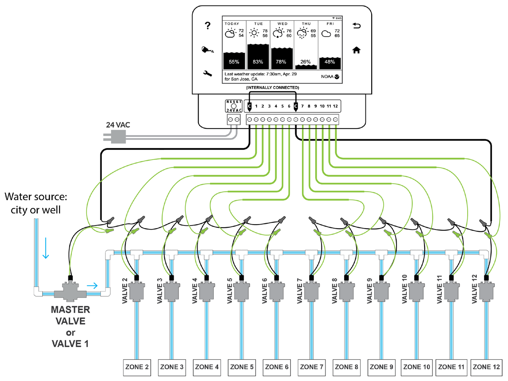
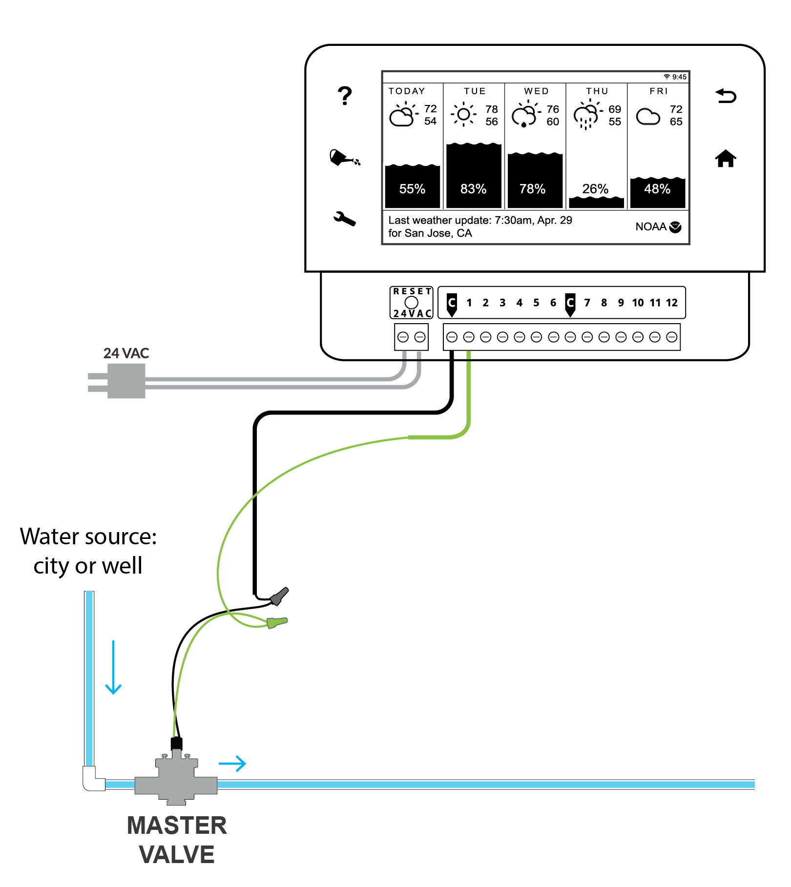
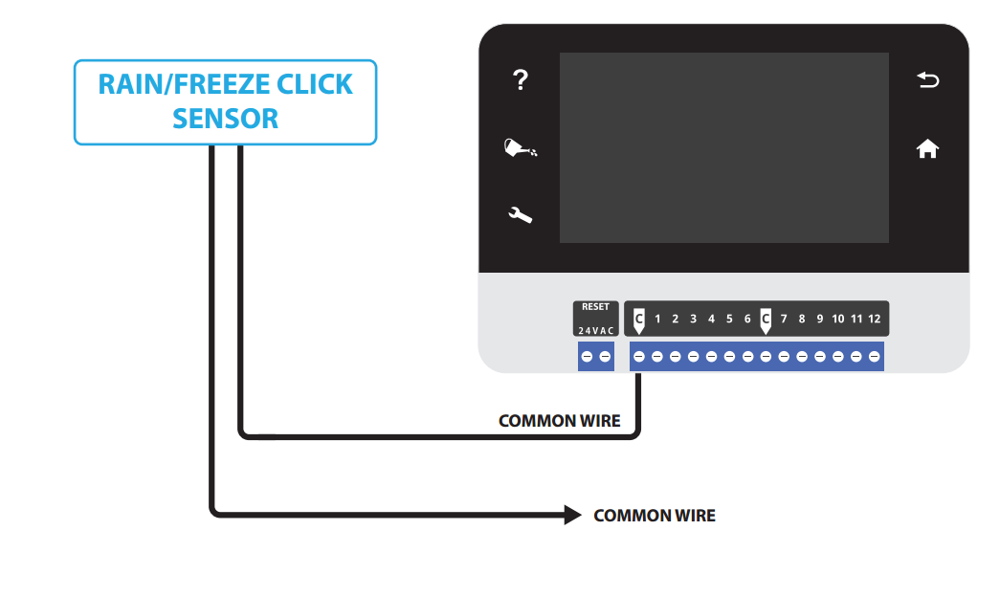
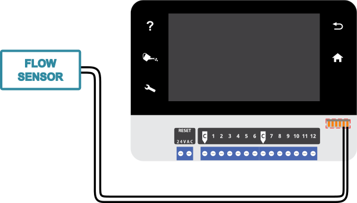
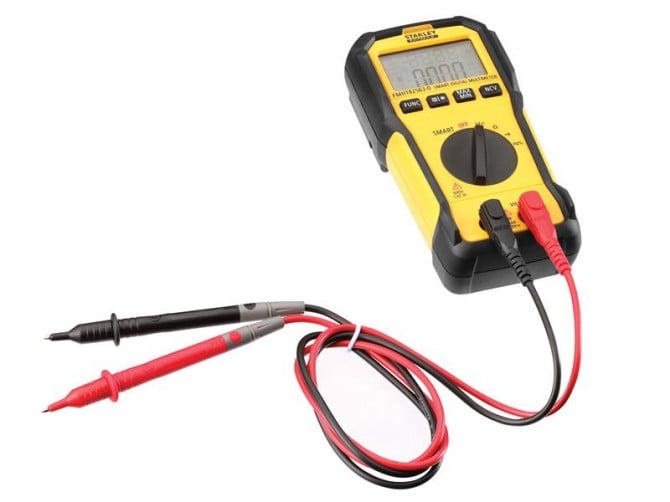

# Controller — RainMachine HD-16 TOUCH

This homeowner runs a **RainMachine HD-16 TOUCH** (`setup.yaml`). RainMachine document the
**HD-12 and HD-16 together** — same board, same terminal layout, same wiring; the HD-16 just has
16 zone terminals instead of 12. Everything below applies to the HD-16.

**Coverage note.** Hardware, wiring, sensor-wiring and Wi-Fi setup/recovery are covered here. The
watering logic — programs, scheduling, restrictions, and the *software* side of sensors (enabling a
flow meter, clicks-per-m³, master-valve toggle) — lives in `app.md`. Deep firmware / cloud-account
faults are still web-only: fall back per `sources.md` (RainMachine support
https://support.rainmachine.com/).

## The terminal block

Across the bottom of the unit, left to right:

- **24VAC** (two terminals) — the low-voltage power from the wall adapter. Polarity doesn't matter.
- **RESET** — recessed button between the power and zone terminals.
- **C** — Common. There are **two C terminals and they are internally connected**, so it doesn't
  matter which you use; the second one is there purely for tidier wiring. Every valve common lands
  on a C.
- **1 … 12** (HD-16: **1 … 16**) — the zone station outputs. Each zone valve's hot wire lands on its
  own numbered terminal; with the station active that terminal carries **24–28 VAC** against C.

On this system the wall adapter feeds 24VAC, the four zone valves land on **1–4** with their commons
on **C**, and one further output drives the pump start relay (see next section).

## Master valve / pump output

Any zone can be **re-assigned as a Master Valve / Pump** output (set in the app — see `app.md`). A
master-valve output switches **on before any program zone opens and stays on until the program ends**,
so it can drive either an inline master valve on the supply, or — through a relay — a pump.

On *this* system there is no separate inline master-valve solenoid. Instead the master-valve output
drives the **Hunter PSR-22 pump start relay** (`relay.md`), whose 24 V coil switches 230 V to the
**DAB Jet** well pump. The pump starting is what pressurises the line, and `setup.yaml` records a
**5-second pump-start-to-valve delay** so pressure is up before a zone opens. So the controller's
"master valve" feature is in use here — it just starts the pump rather than opening a valve.

> ⚠️ The relay's 230 V side and the pump are mains work — refuse and recommend a pro. The 24 V
> controller→relay coil wiring is safe to handle.

The generic wiring (for reference — an inline MV solenoid, not what's fitted here): the master valve
solenoid's two leads go to the **master-valve output terminal** and to **C**, exactly like a zone
valve.

## Sensors — wiring (rain/freeze and flow)

> Only **one sensor can be connected at a time — a rain sensor OR a flow sensor, never both.**
> Connecting two can permanently damage them. The *software* side (enabling the flow meter, entering
> clicks-per-m³, the rain-sensor normally-closed toggle) is in `app.md`.

**Neither sensor is fitted on this system.** `setup.yaml` records the flow meter and pressure meter as
deliberate *opt-outs* (programs run one zone at a time, so their diagnostic value can be inferred
elsewhere), and rain-skip already comes from the weather/ET data over Wi-Fi — no wired rain sensor
needed. The wiring below is reference / upgrade material.

**Rain / freeze "click" sensor** — a dry-contact switch that simply **cuts the common** when it trips
(no power source of its own). It wires **in series with the common**: the sensor's two wires go
between the valves' common wire and the controller's C terminal, so when it senses rain (or freeze) it
breaks the common and watering stops.

**Flow sensor** — the HD-12/16 supports **only two-wire (reed-type) flow sensors**, connected between
the two flow-input pins (no polarity — it's a magnet-driven open/close switch). Hardware limit: the
flow input captures pulses up to **2 Hz (3 clicks per second)**; above that the unit misses pulses and
under-reports flow, so check that the meter's clicks-per-unit × your peak flow stays under that limit
before buying. Most meters send 1 click per 10 gallons (~38 L), well within range.

## Wi-Fi — setup and recovery

The HD-12/16 connects via a **USB Wi-Fi stick**. To connect or change networks: on the touchscreen tap
**Settings → System → Wi-Fi**, pick your home SSID from the list, enter the password, and wait for the
Wi-Fi LED to go solid. Once online it fetches weather and becomes reachable from the app on the same
network. (Enter your **exact home address** at setup for accurate forecasts, and **confirm the
verification email** or remote access won't work.)

Common faults:
- **"WiFi Settings Error"** → almost always the USB Wi-Fi stick: clean its connector and the port, try
  the **other USB port**, or swap in another known-good stick.
- **Is the radio dead, or is it the router?** Turn on your **phone's mobile hotspot** and connect the
  RainMachine to it; then **Settings → System → Network Tools** should read all "OK". If it works on
  the hotspot, the unit is fine — the problem is your router/ISP. (Hotspot is a test, not a permanent
  setup.)
- **Drops randomly** → the router may be **auto-switching Wi-Fi channels**; disable auto-channel.
- **Duplicate IP / DHCP** → don't put a static IP inside the router's DHCP pool; set everything to
  automatic DHCP or give each device a unique address.
- **Remote (Direct) access** → the relevant port must be forwarded on the router (1st-gen HD-12 sold
  before July 2015: **443 / 18443**; 2nd-gen: **8080 / 18080**).

## Zone won't turn on — the hardware path

First decide software vs hardware: **run the zone manually** (app or touchscreen). If it runs manually,
the wiring and valve are fine — the problem is in the watering logic, go to `app.md` (restrictions,
inactive zone, available water, adaptive frequency). If it still won't run manually, it's hardware:

1. 🔧 **Swap the dead zone's wire with a working zone's** at the controller. If the fault **follows the
   wire**, it's the conductor/splice/valve downstream (`wiring.md`, `valve-solenoid.md`); if it
   **stays on the terminal**, it's the controller output.
2. 🔧 With the zone active, **measure voltage** at its terminal against C — see the test below. 0 V on a
   terminal that stays dead after the swap points at the controller (contact RainMachine support).
3. **More than one zone dead at once** → suspect a **break in the common wire**: every zone downstream
   of the break loses its return path and stops. Check the common first.
4. Program **stalls at one zone showing 00:00 run time** → that solenoid may be shorted/stuck and
   tripping the controller's over-current protection. Pull that zone's wire, reschedule, and see if the
   program then completes (`valve-solenoid.md`).
5. Last resort, if programs still won't run after the above: **factory reset** the controller.

Any live symptom should go through the troubleshooter (`playbooks/troubleshoot.md`) rather than be
chased free-hand.

## Testing voltage at the controller terminals

Irrigation valves are driven by a 24 VAC signal from the controller. Although it is low voltage,
Hunter still recommends a trained person perform these tests.

Method (AC-voltage setting):
- 🔌 Activate the station you want to test.
- 🔧 Touch one probe to that **station terminal** and the other to the **C / COM** terminal.
- Polarity does not matter for AC; for consistency, use the black probe on C and the red probe on
  the station terminal.
- ✅ Expect **24–28 VAC** with the station active. (~26 VAC, as shown, is normal.)

Interpretation:
- **24–28 VAC present** → controller is delivering signal; move downstream (wiring, then solenoid).
- **0 V** → no controller output on that station (controller hardware/config, or no power).
- **Low / fluctuating** → suspect the conductor or a poor connection on that run (`wiring.md`).

A quick cross-check: swap the suspect station's wire to a known-good terminal at the controller. If
the problem follows the wire, it is downstream; if it stays on the terminal, it is the controller.

## See also
- `app.md` — the software side: programs, restrictions, sensor config, master-valve assignment.
- `wiring.md` — conductor runs, continuity, swap-wire test, the common wire.
- `valve-solenoid.md` — voltage and resistance at the valve end.
- `relay.md` — the PSR-22 pump start relay this controller's master-valve output drives.
</content>
</invoke>
