# Heads — rotors, spray bodies, MP Rotator nozzles

The heads are the parts that actually spray water at the lawn. Three components (see `graph.yaml` for what is fitted per zone):

- **I-20 rotors** — pop-up rotors for the large open areas (long radius, slow rotation). Covered in full below.
- **Pro-Spray PRS40 bodies** — pressure-regulated pop-up bodies (~2.8 bar at the nozzle) that carry the MP nozzles. See `heads-spray.md`.
- **MP Rotator nozzles** — multi-stream nozzles that screw into the PRS40 for tighter, slower coverage of flower beds and odd-shaped areas. See `heads-spray.md`.

Read this when the engine narrows to the heads area, when something looks wrong at one head, or when the homeowner is changing a nozzle or replacing a body. The I-20 rotor is below; for an MP/PRS40 symptom (misting, MP won't rotate, regulator) go straight to `heads-spray.md`. For weeping that *looks* like a head fault but might be the valve, see `valve.md` *Weeping when off* — the distinguishing test is below in *Low-head drainage*.

## I-20 rotor

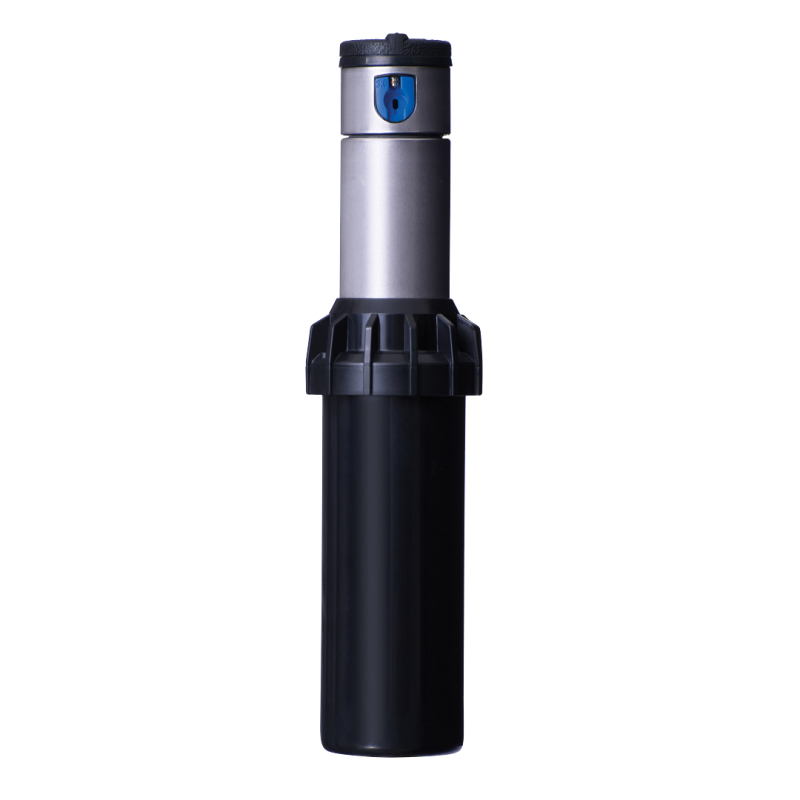

Hunter's mid-range gear-drive rotor. The **I-20-04-SS** variant has a 4" pop-up height, stainless-steel riser, radius setscrew, and FloStop. The rotor's drive is non-strippable, meaning turning the turret backwards by hand will not damage internals.

### Operating envelope

- Radius: **5.2–14 m**
- Flow: **1.4–56 l/min** ≈ 0.08–3.4 m³/h
- Recommended pressure: **1.7–4.8 bar**
- Operating pressure: 1.4–6.9 bar
- Precipitation rate: ~10 mm/hr
- Nozzle trajectory: standard 25°, low-trajectory 13°
- Drain check valve: holds back up to ~3 m of elevation
- Warranty: 5 years

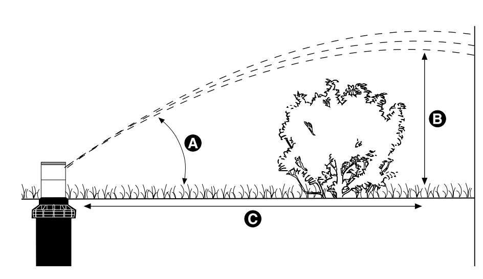

Use the trajectory geometry to check clearance: a standard 25° nozzle at the I-20 envelope peaks around 3–4 m above grade at 6–10 m out, so a 2 m hedge or fence within ~8 m of the head will clip the stream. Switch to the grey low-trajectory (13°) nozzle for those spots — peaks at ~1–1.5 m height.

### Construction and variants

- Body and riser: corrosion- and impact-resistant ABS plastic; stainless-steel riser spring.
- Variants exist as shrub head, 4" plastic, **4" stainless-steel (-SS)**, 6" plastic, 6" SS, and 12" plastic. The number is the pop-up height.
- Factory-installed rubber boot/cover protects the top of the body.

### Features

Beyond the adjustment/service detail below, two are worth knowing: **automatic arc return** (a kicked or vandalised turret returns to its original arc the next time the zone runs) and the **QuickCheck** through-the-top arc mechanism (tweaks without pulling the rotor). Radius/arc adjustment (40°–360°), Flo-Stop, and the stainless `-SS` riser each get their own coverage below.

### Nozzle racks

The I-20 ships with multiple nozzle sets, colour-coded by category:

- **Blue** (standard): 1.5 to 8.0 — the default rack, used at recommended pressure.
- **Grey** (low-trajectory, 13°): 2.0 to 4.5 — for windy spots or near walls where the standard 25° oversprays the target.
- **Black** (short-radius): 0.50 to 3.0 — for tight zones below ~6 m.
- **Dark green** (high-flow): 6.0 to 13.0 — for a long radius on high-flow zones.
- **MPR-25 / MPR-30 / MPR-35** — matched-precipitation rates at 7.6 / 9.1 / 10.7 m radii.

Mixing nozzle sizes within a zone is how installers balance differently-sized arcs so each head finishes the design radius at the design pressure.

### Common faults

- **Won't pop up.** Debris in the well, weak riser seal, body cracked. Most often: a pebble or twig in the well. Pull the cap and clear. Low system pressure is also a suspect — check pressure at the manifold while the zone runs. Note: a worn riser seal causes *flow-by* (water flushed out as the riser starts to rise) which bleeds the pressure needed to seat the riser; Hunter rotors are designed for zero flow-by, so visible flush during pop-up = replace the riser seal + spring seat. If the whole zone is weak (not just this head): a punctured hose after recent garden / fence / driveway work is the textbook failure mode — see `hoses.md` *Broken-hose signature*. Could also be a partly-stuck valve diaphragm restricting flow to the zone — see `valve-internals.md`.
- **Pops up but won't rotate.** Sand or grit in the drive, or the nozzle is too small for the available pressure (a gear-drive needs flow to drive). Pull the rotor, flush in clean water, reinstall. Persistent → replace the rotor. The bottom-of-internal-assembly **filter** is the most common culprit before the drive itself — pull it with needle-nose pliers and rinse before condemning the rotor (see *Adjustment & service procedures* below).
- **Wrong arc / always 360°.** The FloStop or arc adjustment is at end-stop. Reset per the Hunter wrench instructions. Auto arc return will bring the original arc back the next time the zone runs. Don't step on or kick rotors during mowing — the impact drifts the right stop, and auto arc return is the recovery, not a license to abuse the head.
- **Right-side arc off (wet walkway / dry turf strip on one edge).** The fixed right stop has drifted. Reset by rotating the turret fully clockwise, then counterclockwise back to the right stop. If still misaligned, either rotate the whole body+fitting to the desired position, or unscrew the body cap, remove the internal assembly, rotate the turret to the right stop, and refit with the nozzle pointing at the start of the desired arc — then re-adjust the left arc. No need to dig the body out.
- **Uneven coverage / brown spots.** Nozzle mismatch, wrong radius set, or a downstream head is starving this one of pressure. Check pressure at the head while running.
- **Water draining from the lowest head when the system is off.** The drain check valve is missing or failed. See *Low-head drainage* below.
- **Riser stuck up after the zone shuts off.** Debris in the well or a fatigued retract spring. Clean the well; replace the spring if the body is old.
- **Leak around the riser stem (water seeping past the riser while the head runs).** Riser seal worn — common in sandy soil, sunken heads, or after extreme temperature cycles. Replaceable; see *Adjustment & service procedures*.

### Adjustment & service procedures

The I-20 carries four top callouts (visible after pulling the riser up by its lifting socket): **Lifting Socket**, **Arc Adjustment** (left dial), **Nozzle / Radius Adjustment Screw** (top centre), **Flo-Stop** (right dial). Adjustments may be made with water on or off; factory preset is ≈180°.

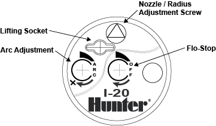

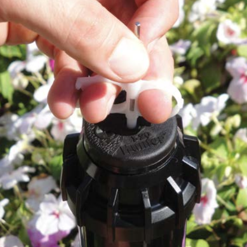

**Hunter adjustment wrench.** The right tool is a Hunter wrench: a 3/32" Allen key on one end, plastic arc-adjustment key on the other, with two finger loops. A bare 3/32" Allen key works for radius adjustment only. The plastic-only consumer key (no Allen end) engages the same lifting / arc / flow-stop sockets and is fine for arc and lift work, but won't drive the radius screw.

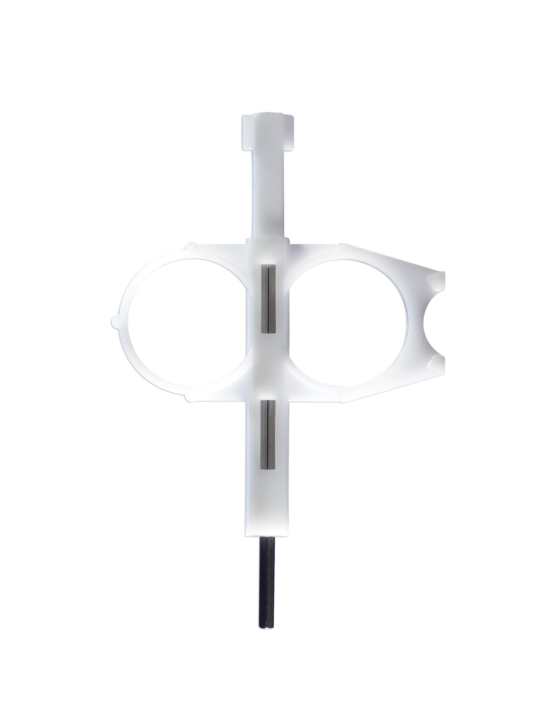

**Arc adjustment (40°–360°).**
1. Insert the plastic key end into the arc adjustment socket.
2. Hold the nozzle turret at the right stop.
3. Each full 360° turn of the wrench = 90° of arc change. Clockwise increases the arc; counterclockwise decreases it.
4. The wrench ratchets / stops at the 360° max and at the 40° min — don't force past either.

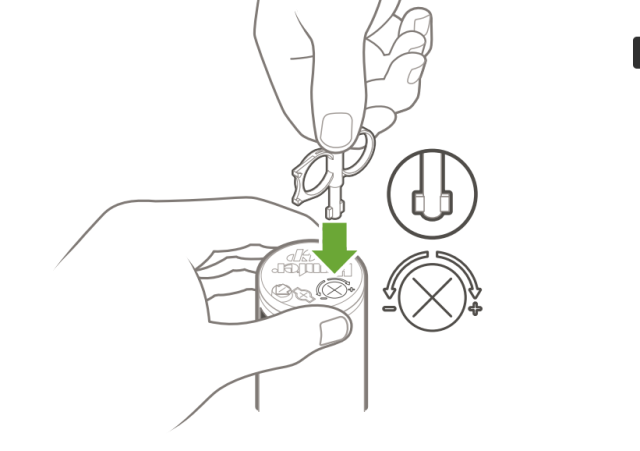

**Radius adjustment (up to −25%).**
1. Insert the 3/32" Allen end into the radius (retention) screw on top of the nozzle.
2. Clockwise into the stream = shorter radius; counterclockwise = longer radius. Best done with water on so you can see the change.
3. **⚠️ More than five full clockwise turns can drop the screw out of the nozzle.** Replacement screw is sold separately if lost.

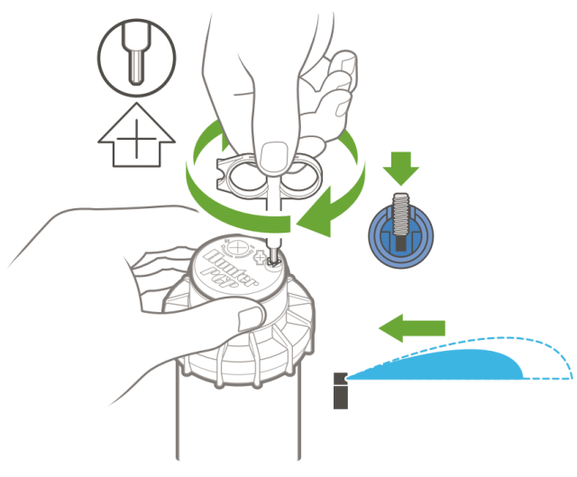

**Nozzle install / replacement.** Use Hunter's nozzle insertion collar (P/N **123200**) — a white plastic sleeve that clips around the riser body to hold it up while you work — plus the adjustment wrench. The slot layout on the I-20 cap is the same as on the PGP.

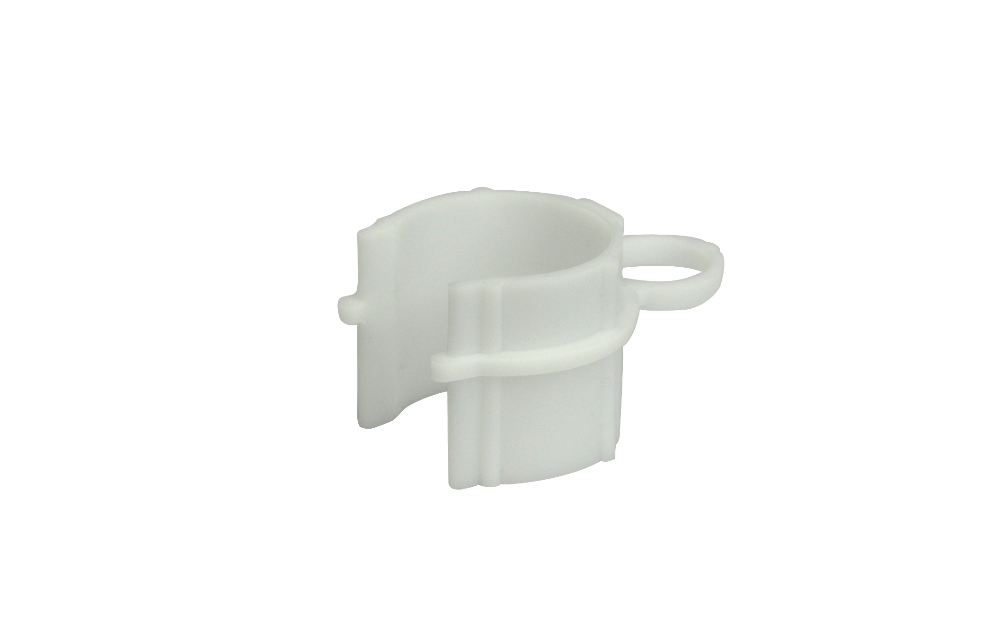

1. 🔧 Insert the plastic end of the adjustment wrench into the **lifting socket** on top of the cap and turn 90°. Pull the riser up — the nozzle port is now accessible. Slide the insertion collar over the riser body to hold it up.

   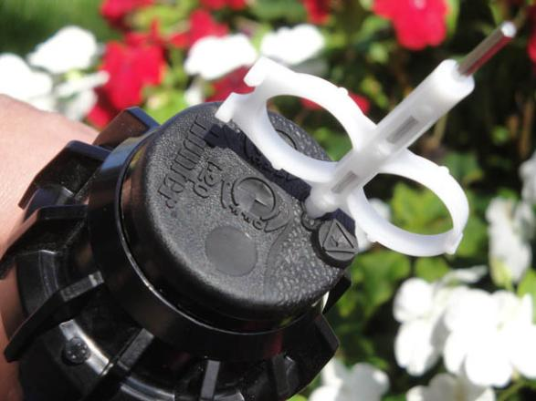

2. 🔍 Visually check the **nozzle / radius adjustment screw** isn't blocking the nozzle socket. Slip the nozzle in — the socket is tilted up 25°. The triangle on the rubber cover marks the direction of water flow when the rotor is retracted, so it tells you which way the nozzle will spray.

   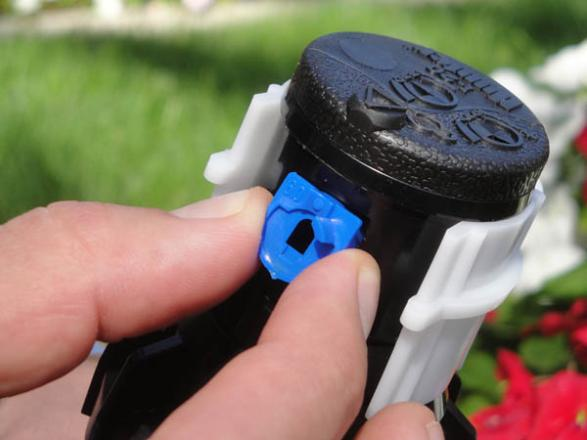

3. Turn the **nozzle / radius adjustment screw** a **quarter turn clockwise** to lock the nozzle in place. ⚠️ More than a quarter turn starts to reduce the radius — don't over-turn.

   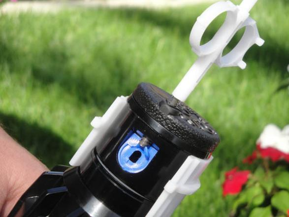

After install: ✅ cycle the head a couple of times to confirm the nozzle is locked and the rotor returns to its arc. Use Flo-Stop (below) if you don't want to run the whole zone for that check.

**Flo-Stop (shut off one rotor while the zone runs).** Insert the Hunter wrench into the centre hole of the rubber cover (the Flo-Stop port) and turn clockwise until flow at this head stops. Use this for nozzle swaps or quick service without shutting the whole zone. Turn counterclockwise to restore flow.

**Filter cleaning (when a rotor won't rotate).**
1. Unscrew the body cap counterclockwise. After a season or two it may need pliers to break free.
2. Lift the internal assembly out of the body.
3. The filter is the cylindrical screen at the very bottom of the internal assembly; 🔧 pull it out with needle-nose pliers.
4. Rinse under clean water, refit, screw the assembly back in.
5. I-20 filter spec: **.050" (1.27 mm) square openings, ~14 mesh, ~1410 µm**. Replacement P/N **102600-SP** (same screen as PGP-ADJ / PGP Ultra).
6. If clean filter doesn't restore rotation, the gear drive is gone — replace the rotor.

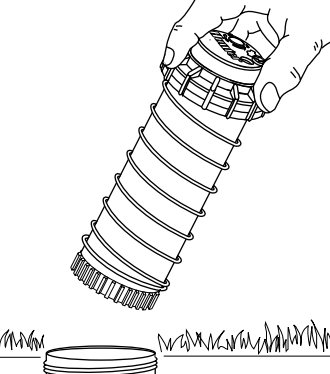

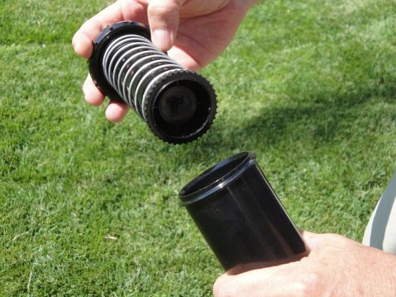

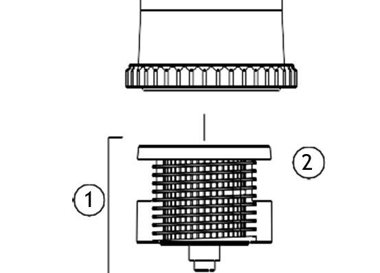

**Riser seal replacement (P/N 181500; kit of 10 = 253400).** Worn seals show as water leaking around the riser stem during operation, or as flow-by that prevents pop-up.
1. Unthread the body cap and remove the internal assembly.
2. Stand the riser on a solid surface, grip the spring and riser body firmly.
3. With the other hand, snap the body cap off the top of the turret (palm on the logo cap, pull up with fingers).
4. While still gripping, remove the old rubber seal — the spring's tension releases when the seal comes off.
5. Remove the plastic spring seat (it may have already popped off).
6. To install the new seal: with the base on a solid surface, push the retraction spring down below the nozzle turret and hold it there. Drop the new rigid spring seat onto the riser grooved-side-down. Work the new flexible rubber seal (flat side up) onto the turret and then down onto the riser body — don't twist or deform it as it crosses the gap between turret and shaft. Snap the body cap back on (it slides freely once past the ring at the top of the turret). Release the spring.
7. ✅ Cycle the riser by hand several times to seat the parts so they don't stick.
8. Screw the internal assembly back into the body — ⚠️ **hand-tight only, no threads visible under the cap**. If threads can be felt, the seal isn't seated; redo it.
9. 🔍 Re-check installation height (set to grade) before turning on for leak test.

**Drain check valve (low-head drainage at this rotor).** Hunter sells a screw-in check valve sub-assembly (P/N **142300**, Filter/Screen Check Valve combined). To fit: unthread the body cap, pull the internal assembly, flip upside-down, push the large irregular end of the check valve into the bottom of the riser (the small rubber tip stays outside the riser), refit the internal assembly.

**Temporary shutoff of one rotor (without removing the head).** Use the blank nozzle from the I-20 Low-Angle Nozzle Set (P/N **356605SP**) — it pops up with the zone but throws no water. **Temporary use only**: the riser still pops up, so this is not a permanent cap, and the blank must be removed before winterization. For a true permanent cap, see `hoses.md` *Capping or shortening a hose*. Note: I-20s with Flo-Stop can simply use Flo-Stop for temporary shutoff — the blank nozzle is mostly useful for flushing a hose during maintenance.

**Capping off an I-20 in-ground (permanent removal).** Removing a head is the most common reason to cap or shorten a hose, so the full procedure lives with the hose material — both the mid-hose case and the last-head-on-a-winterized-hose case, plus the dead-end rule that drives them, are in `hoses.md` *Capping or shortening a hose*.

**Setting height to grade — swing joint vs hard riser.** When you replace a rotor, the new head should sit flush with the surrounding turf (top of cap just at grade, not proud, not sunk). A SCH80 nipple riser fixes the height at install — measure twice. A Hunter swing joint (flexible elbowed link between the hose and the rotor inlet) lets you adjust height after the head is installed and absorbs side load from pedestrian traffic or settling soil — the better choice on a sandy/settling site. The I-20 inlet is **¾" NPT**; use Teflon tape on the threads.

## Low-head drainage (wet patch at the lowest head when the system is off)

Two distinct failure modes, with the same symptom:

1. **Drain check valve missing or failed at the head.** The cheap, common fix. Both the I-20 and the PRS40 have factory or user-installable drain check valves, rated to ~3 m and ~4.3 m of head-to-hose-high-point elevation respectively. If the hose has more elevation than the check valve holds, the water above the valve will still drain. Upgrade to a stronger check valve or install in-line check valves on the hose.
2. **Water passing through the zone valve when shut.** The valve itself is letting water trickle through after closing — see `valve.md` *Weeping when off*. The tell: drainage doesn't stop after the hose empties; it keeps going.

**Distinguishing test:** a check-valve issue **self-stops** once the hose above empties (a finite puddle, then dry). A valve leak **does not self-stop** — it weeps continuously as long as the main hose is pressurised. Do not assume the valve, and do not assume the head; let the symptom decide.

## See also

- `heads-spray.md` — Pro-Spray PRS40 bodies, MP Rotator nozzles, and the MP ↔ PRS40 pairing (the regulated-spray side).
- `valve.md` — *Weeping when off* for the valve-side failure mode of low-head drainage; also for valve-side regulation when PRS40 isn't enough (Accusync).
- `valve-internals.md` — partly-stuck diaphragm restricting flow to a zone, an alternative failure mode when a whole zone is weak.
- `hoses.md` — *Broken-hose signature* and *Capping or shortening a hose* for the zone-wide-weakness case and for head removal/cap-off planning.
- `wiring.md` — heads are mechanical only; no wiring at the head.
- `graph.yaml` — per-zone head counts and types for this system (`flow:`).
