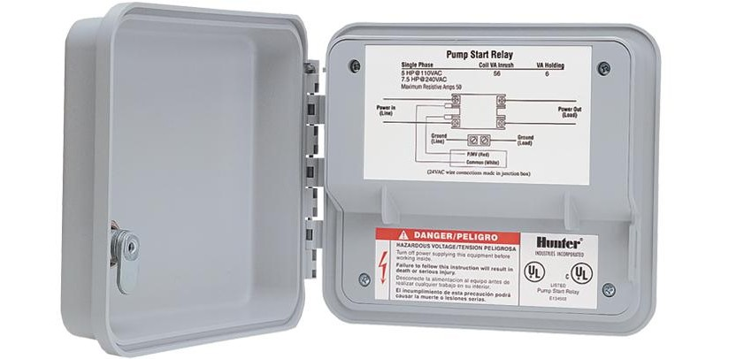
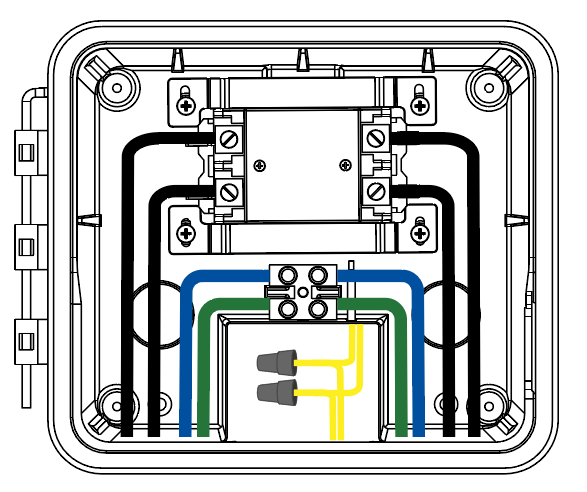

# Pump start relay — Hunter PSR-22

The relay sits between the controller and the well pump: the controller sends a 24 V signal to
the relay coil, and the relay switches 230 V power through to the pump. It is driven from the
controller's P/MV (pump) output, ideally on a **dedicated** common separate from the zone-valve
common. (See `setup.yaml` for this install's relay model, location, and wiring.)

> **⚠️ Safety — read first.** Everything on the power-supply side of the relay is 230 V work
> (120/230 V). Connecting or opening the relay should be done by a licensed electrician following
> local codes; improper work risks shock or fire. Always switch the main circuit breaker off before
> any connection. Do not ask the homeowner to perform 230 V-side wiring — flag the risk and point
> them to a professional. The 24 V controller-side signal checks are low-voltage and homeowner-safe.

## Power-supply connection (wire colours / terminals)

> Electrician-only. Turn the main breaker off before any connection.

| Wire | Role | Connection |
|---|---|---|
| Black | Hot | Single hot for a 120 VAC connection |
| Black | Hot | Second hot for a 240 VAC connection |
| Blue | Neutral | Through the terminal connector block |
| Green | Ground | Through the terminal connector block |
| Yellow | Controller common | To the C (common) terminal in the controller |
| Yellow | Controller P/MV | To the P/MV (pump) terminal in the controller |

- Assemble conduit and connect power supply to the LINE IN side of the relay.
- Assemble conduit and connect the pump-motor wiring to the LOAD OUT side.
- Check no exposed or loose connections.

## Controller connection (P/MV + common)

1. Remove the relay cover plate (four Phillips screws).
2. Run a single wire from the controller **common** terminal to one yellow relay wire.
3. Run a single wire from the controller **MV/Pump** terminal to the other yellow relay wire.
4. Make the joints with the enclosed wire nuts; check they are secure.
5. Refit the cover plate and screws; close and lock the cabinet.

The yellow wires in the relay's lower wiring compartment are the ones that go to the controller.

## Run length to the controller

The 4.5 m minimum separation is also labelled on the wiring diagram above.

**Minimum.** Keep at least **4.5 m** between controller and relay. When the relay contacts
make and break, they generate electromagnetic noise that can travel back along the 24 V coil wires;
the separation dampens it. Hunter also recommends mounting controllers ≥4.5 m from pumps and other
high-voltage devices.

**Maximum.** One-way wire length controller → relay must not exceed the figures below (converted
from the vendor's AWG values; mm² are nearest-standard equivalents):

| Model | 0.75 mm² (18 AWG) | 1.5 mm² (16 AWG) | 2.5 mm² (14 AWG) | 4 mm² (12 AWG) | 6 mm² (10 AWG) | 10 mm² (8 AWG) |
|---|---|---|---|---|---|---|
| PSR-22 | 74 m | 118 m | 188 m | 298 m | 473 m | 751 m |

Typical residential controller→relay runs sit comfortably within range on any sane gauge, so the
table is useful mainly to **exclude** wire length as a failure mode. (Check the actual run length in
`setup.yaml`.)

## Electrical specifications

> **Re-check before relying on these numbers.** The figures in this section were sourced for the
> **PSR-52** and have **not** yet been confirmed against the **PSR-22** that `setup.yaml` records as
> the installed unit. The PSR-22 is a different (smaller) relay; treat the HP/amp/coil values below
> as PSR-52 placeholders until checked against Hunter's PSR-22 data.

Configuration: **double-pole (DPST)** — the 24 V coil closes both legs of the supply
together, so the relay switches a 120 VAC pump up to 3 hp or a 230 VAC pump up to 7.5 hp.

Switching capacity:
- Max full-load amps: 40 A
- Max resistive amps: 50 A
- HP at 120 VAC: 3 hp
- HP at 230 VAC: **7.5 hp**.

Coil (the 24 V side the controller drives):
- Inrush: 60 VA / **2.5 A**
- Holding: 5 VA / **0.21 A**

The inrush is what determines wire sizing on the controller→relay run: the coil draws 2.5 A
*momentarily* every time the controller calls a zone, which is why undersized wire makes a relay
chatter on a new install.

## Chattering / buzzing relay

Chattering is almost always **insufficient amperage** reaching the relay from the controller. The
relay needs 24 VAC *and* substantial current to pull in fully. First question: is this a new
installation or one that has worked for years?

**New installation** → suspect undersized wire from controller to relay. Use a **separate common
wire** from the controller to the relay; **never share the relay's common with the zone solenoids**.
Clean every connection and follow the length/gauge table above.
> If the install already uses a dedicated common and a short run (check `setup.yaml`), the
> new-install wire-size failure mode is effectively ruled out.

**Existing installation** (a relay in service for years) → suspect dirt or insects
inside the relay contactor. Isolate the relay from the incoming power supply and open the contactor
to clean it (electrician if you are not comfortable with electricity). You can disconnect the
120/240 V supply while leaving the relay-to-pump wiring in place and check the relay's performance.
If it still chatters and won't fully engage, check the incoming amperage from the controller and
clean any suspect connections to cut resistance.

Engine cross-links: pairs with Q3 (pump hums/trips vs. silent), Q10 relay-row (recent service), and
Q11 pests (insects in the contactor is the classic existing-install failure mode).

## See also
- `controller.md` — the P/MV output and common that drive this relay; voltage at terminals.
- `wiring.md` — common-wire separation, connector corrosion, run/gauge.
- `pump.md` — what the relay switches power to (when populated).
