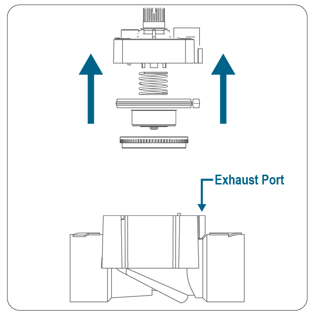
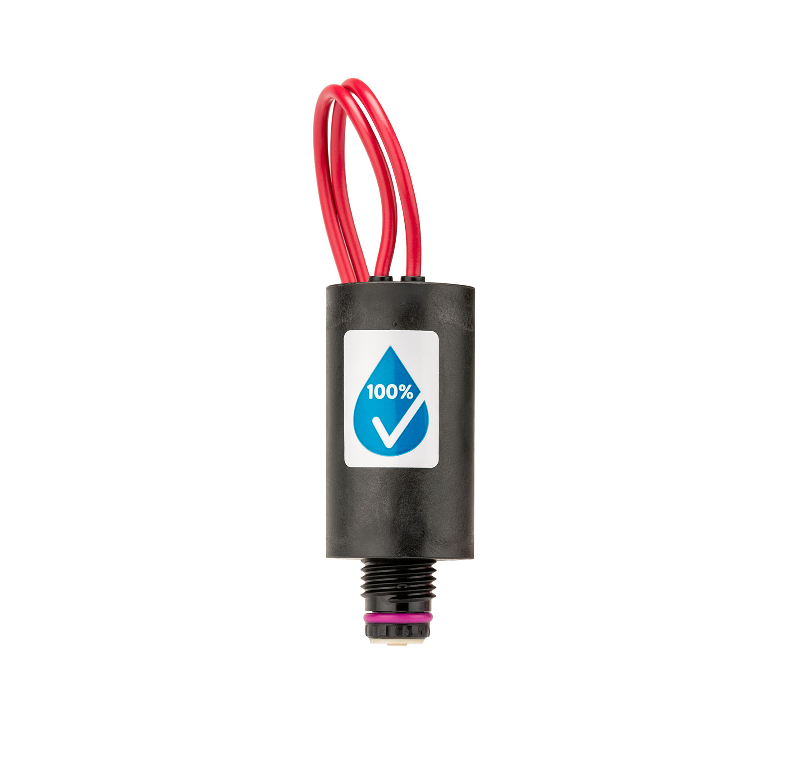

# Valve solenoid

The electrical actuator of the PGV-101G, split out from `valve.md` because it is a frequent
failure mode and a frequent point of exclusion. Read the whole file when the valve is electrically
suspect, or when the homeowner is taking a measurement and needs the exact method. A clean coil
reading is **not** a clean bill of health for the solenoid — a mechanically stuck plunger or a
clogged port reads a perfectly normal coil resistance.

## What it does

The solenoid is the cylinder with two wires on top of the valve. Inside is a light, spring-loaded
metal piston (plunger) that, with the valve closed, covers the inlet port hole into the upper
chamber. Energising the coil (24 VAC) lifts the plunger, uncovers the port, the upper chamber
drains, and the valve opens. De-energise and the spring re-seats the plunger; the valve closes
within ~15 seconds.

There is an **entry port** from the valve upper chamber to the solenoid and an **exhaust port**
from the solenoid to downstream in the valve. If either clogs with debris, the valve may not open,
or not open fully.

**Reverse-flow design (why it matters for surges).** The Hunter solenoid runs on a *reverse-flow*
principle: the centre hole in the solenoid bowl is the inlet port, not the exhaust. One practical
consequence is built-in surge relief — when a pressure spike hits the closed valve, the plunger
lifts slightly to let the spike pass downstream and dissipate through the zone hoses, then re-seats
immediately so the zone does not actually run. So an occasional momentary "blip" at a head on a
water-hammer event is expected behaviour, not a leaking/weeping solenoid. The design is also
efficient on long wire runs under high pressure.

## Manual operation

Turn the solenoid counter-clockwise ¼ to ½ turn to open the valve by hand; clockwise until snug to
close. The arrows stamped on the solenoid body mark the ON / OFF direction. Useful as a first
isolation step: if the zone runs when you turn the solenoid by hand but not when the controller
calls it, the fault is electrical (wiring, controller, or solenoid coil) rather than hydraulic.

## Specifications

- 24 VAC solenoid
- 350 mA inrush / 190 mA holding at 60 Hz
- 370 mA inrush / 210 mA holding at 50 Hz
- Coil resistance (Hunter PGV spec): **20–60 Ω**

## Testing solenoid voltage

Use the AC-voltage setting. Solenoids have two wires — one common, one station power (commons are
usually shared across the system to save wire). With the station activated, 🔧 place one probe on the
common wire and the other on the solenoid's power wire at the valve manifold. ✅ You should read
**24–28 VAC**.

Interpretation:
- 24–28 VAC at the solenoid, valve still won't open → suspect the solenoid coil or a clogged port.
- Much lower / 0 V at the solenoid but present at the controller → wiring/splice fault between
  controller and valve (`wiring.md`).

**Two measurement points, not one.** Read voltage at the **wire splice** in the valve box first,
then at the **solenoid leads**. If 24–28 VAC is present at the splice but drops at the solenoid
leads, the fault is the short tail/connector to the solenoid or the solenoid itself; if it is
already low/absent at the splice, the fault is upstream in the run (`wiring.md`). This isolates a
bad joint from a bad coil before you replace anything.

(Test voltage at the controller end too — see `controller.md`.)

## Testing coil resistance

With the station off, 🔧 measure resistance across the solenoid's two wires:
- **20–60 Ω** → coil is healthy. Does **not** rule out a stuck plunger or clogged port.
- **Open / infinite** → coil is broken (burnt out). Replace the solenoid.
- **Near zero / very low** → coil shorted. Replace the solenoid.
- **OK at the coil but bad reading back at the controller** → the conductor/splice is the fault,
  not the solenoid (`wiring.md`).

## Plunger check

Unscrew the solenoid (counter-clockwise) and ✅ confirm the plunger is clean and moves freely. A
sticky or dirty plunger can fail to lift or fail to re-seat even with a healthy coil. Clean it; if
it still binds, replace the solenoid.

## Clogged exhaust / entry ports (flush procedure)

If the valve turns on via the external bleed screw but not electrically, suspect a port clog.

> **⚠️ Safety:** shut off the main water supply before opening the valve under pressure (on this
> system, pump off — then run a zone to bleed off pressure).

1. Try opening the valve with the external bleed screw. If it opens that way, a port issue is likely.
2. Shut off the main water supply.
3. Remove the captive bonnet screws on top of the valve.
4. Remove the bonnet (with solenoid), diaphragm, spring, and support ring.
5. 🔧 Pass a thin piece of metal — about 0.8 mm² wire, paperclip-thin — through the exhaust
   port to flush out debris (Teflon, glue, dirt).
6. Reinstall bonnet, diaphragm, spring, and support ring.
7. 🔌 Activate the station from the controller to test.

## Replacing the solenoid

If the controller delivers correct voltage (24–28 VAC) at the valve's wire connection and the valve
still won't operate, replace the solenoid. Shut off, unscrew the old solenoid counter-clockwise,
fit the new one clockwise until snug, and reconnect with **waterproof** connectors (`wiring.md`).

Part number: **434100** (solenoid assembly, includes O-ring 262600 and seal 364400). Check
which solenoid is fitted in `system.yaml`. The full PGV parts list is in `valve.md`.

## Wiring to the solenoid

Two leads: one to the shared common, one to the station's power wire. Use waterproof connectors —
corroded joints raise resistance and can blow controller fuses.

## See also
- `valve.md` — operation, install, manual operation, specs.
- `valve-internals.md` — diaphragm metering port (the other "won't open/close" choke point).
- `controller.md` / `wiring.md` — upstream voltage and conductor checks.
