# Zone valve — Hunter PGV-101G

This is the whole-valve neighbourhood. Read it end to end when the engine narrows to
the valve area, when the homeowner is installing/replacing a valve, or when they ask how
the valve works. The dense interior is split out: see `valve-internals.md` (diaphragm,
spring, seat, support ring, metering ports) and `valve-solenoid.md` (coil, plunger,
exhaust/entry ports). Much of what isolates or excludes a valve cause lives in those two.

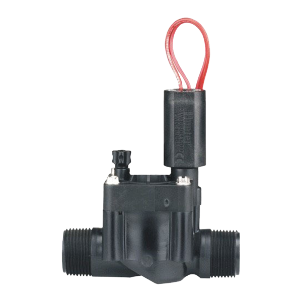

## How the valve works (operation / hydraulics)

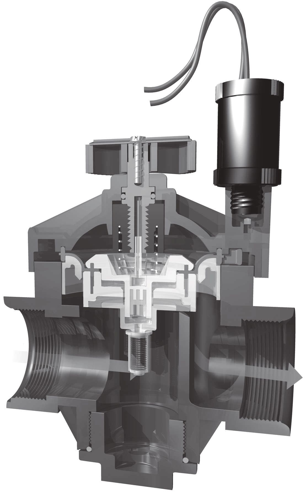

Water enters from the system main line and pushes against the centre of the diaphragm.
A small orifice in the diaphragm lets water bleed through into the upper chamber, between
the diaphragm and the bonnet. From there it travels on through a port in the bonnet to the
solenoid area. The solenoid holds a light, spring-loaded metal piston that — when the valve
is closed — covers the inlet port hole.

The surface area the water acts on **above** the diaphragm is larger than the area **below**
it, so the downward force wins and the valve stays shut. The valve only opens when the water
trapped in the upper chamber is released — which is exactly what energising the solenoid (or
opening the bleed screw, or turning the solenoid) does: it uncovers the port, the upper
chamber drains downstream faster than the metering orifice can refill it, pressure above the
diaphragm drops, and inlet pressure lifts the diaphragm off its seat.

This is why the metering orifice and the solenoid ports are the two places a tiny piece of
debris causes outsized trouble — they govern the pressure balance, not the main flow.

## Parts (external)

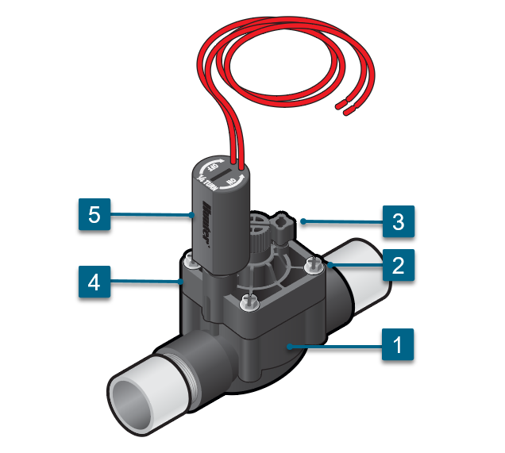

- **Bonnet** — the top section, held by captive bonnet screws (jar-top on some models).
- **Flow control handle** — limits the diaphragm's stroke to throttle flow/pressure.
- **Bleed screw** — external manual bleed; releases upper-chamber pressure to open the valve by hand.
- **Solenoid** — the cylinder with two wires; the electrical actuator (see `valve-solenoid.md`).

Interior parts (support ring, diaphragm, spring, seat) are in `valve-internals.md`.

## Manual operation

There are two ways to open a zone valve by hand. Both release upper-chamber pressure.

**1 — Turn the solenoid**

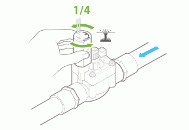

Turn the solenoid (the cylinder with two wires) counter-clockwise ¼ to ½ turn. To close,
turn it clockwise until snug on the valve.

**2 — Open the bleed screw**

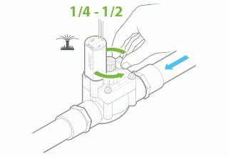

Loosen the bleed screw just enough to release air — ¼ to ½ turn. Hand-tighten it to close
the valve again. Some water trickling from the bleed screw is normal.

Where a manual hose is fed off the manifold (see `setup.yaml`), the pump is started from the
controller, and with all solenoids shut the manual hose fills and can be opened at the hose
end. The valve closes within about 15 seconds after the solenoid or bleed screw is returned
to its closed position.

## Flow control adjustment

The flow control knob behaves like a tap/gate — its job is to allow or restrict the water
passing through the valve. Mechanically it limits the diaphragm's stroke: the control rests
on top of the diaphragm and caps how far it can lift, which adds pressure loss and lets you
fine-tune head performance.

A fully open valve (4–5 full turns counter-clockwise) can pass ~5 bar, which is too much for
some heads such as pop-up sprays. Throttling the flow control brings pressure down to a workable
level. Where the spray bodies are pressure-regulated (e.g. PRS40 at ~2.8 bar), flow control is
mostly relevant to balancing zones, not protecting heads.

## Bonnet air relief (water hammer)

The PGV bonnet has an air-relief feature worked through the flow-control stem: pushing the stem
**down** vents any air trapped under the top of the bonnet, then water pressure pushes the stem
back up and re-seals without leaking. Burping that trapped air is the cheap first move when a
zone starts up with a bang (water hammer) on the first cycle of the season or after the valve
has been serviced. Do this before chasing water hammer further upstream.

## Per-valve pressure regulation (Accusync) — when flow control isn't enough

Flow control on the valve is a *throttle* — it bleeds pressure as a function of how
restrictive you've made it. It works fine when supply pressure is steady. It does **not**
hold the downstream pressure at a fixed setpoint when supply pressure varies, the way a
pressure-regulating body or a dedicated valve-level regulator does. The three options
form a tier:

1. **System-wide pressure regulator** (upstream of the valve manifold). Coarse and
   simple — every zone sees the same regulated pressure, and you lose the ability to
   tune individual zones. Useful when supply pressure is wildly higher than every zone
   needs and design varies little between zones. Not fitted in every system; covered as
   F6 context in `sources.md`.
2. **Per-valve pressure regulator (Hunter Accusync).** Sits on each individual valve
   and holds its downstream pressure at a per-zone setpoint regardless of upstream
   variation. The right answer when zones have **elevation changes** or **long hose
   runs** that make zone-by-zone pressure drop unequal. Each zone gets its own design
   pressure, which the rest of the system can't see.
3. **Pressure-regulated body at the head** (PRS30, PRS40, PRB rotors). The finest level
   of control — every head holds its nozzle pressure regardless of what arrives. The
   PRS40 variant of Pro-Spray, used for MP Rotators, is why MP heads run consistently
   across zones.

**Regulation tiers in practice.** The PGV-101G valve is **not** pressure-regulated, so where
no system-wide regulator is fitted, regulation falls to the heads — PRS40 bodies hold the MP
nozzles at setpoint, while unregulated I-20 rotors rely on supply pressure landing in their
1.7–4.8 bar window (see `heads.md`, and `setup.yaml` for what is actually fitted).

When to think about Accusync: if a zone is **consistently misty or over-radius** at
the heads, the PRS40 isn't engaging (inlet too low — see `heads.md` *Misting from the
MP on top*), and the cause is *not* a single head's regulator failing but the whole
zone running too hot or too cold, then a per-valve regulator on *that* valve is the
standard remedy. Treat it as a design fix, not a troubleshooting one — bring it up
once the routine causes (filter, nozzle, riser seal, broken hose) are ruled out.

## Installation (and how to avoid causing damage)

**The quick tell that answers most "where does the teflon go" questions — lead with it, in these
words: if the joint has a rubber O-ring (or rubber ring) inside, or its nut clamps onto the hose,
leave the threads bare — the rubber or the clamp is what seals.** ⚠️ Taping those threads stops
the rubber seating or the nut pulling up tight, which leaks. Teflon only goes where bare thread
screws into bare thread — the tapered male threads going into a female port (the valve's
inlet/outlet). "Rubber O-ring" is the phrase a homeowner gets instantly; reach for it before
"washer" or "compression grip", and gloss those terms the first time you use them.

In *this* system two joints flank the valve, and both keep their threads bare (no teflon): the
**manifold swivel nut** on the inlet (the loose ring-nut with a rubber O-ring inside) and the
**PE compression nut** where the outlet meets the `hose.25` poly run (the green nut that clamps
onto the hose). Give the paste/tape mechanics below after the quick tell — don't make the user
pull it out over several turns.

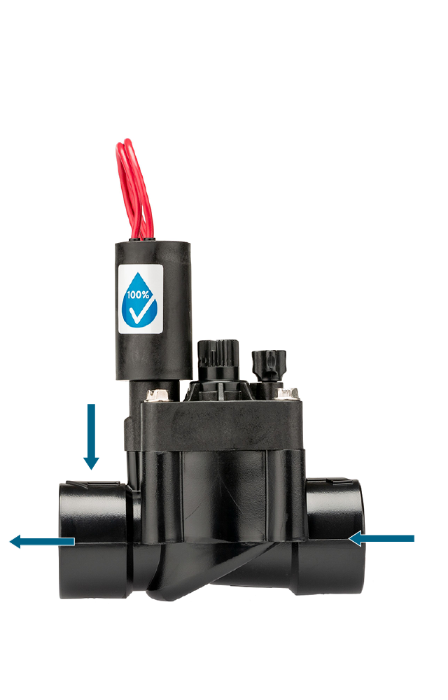

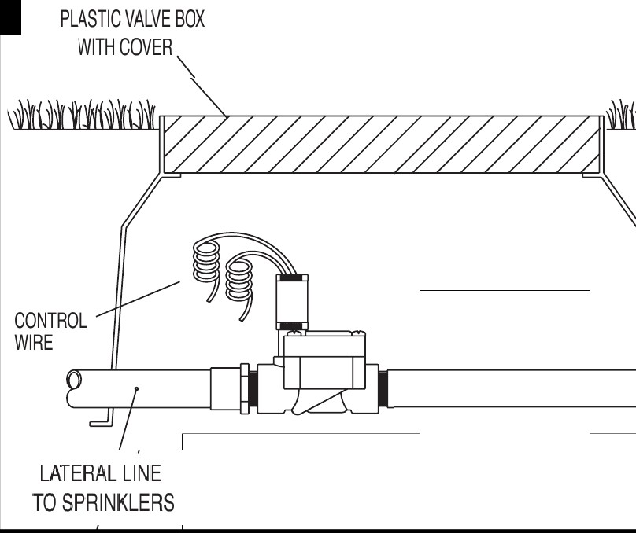

**Placement.** Put the valve manifold somewhere accessible for maintenance, close to the
area the valves serve, but positioned so you are not sprayed when you operate the system by hand.

**Orientation — the single most common new-install fault.** Each valve has an inlet and an
outlet, with an arrow moulded into the body showing the direction water must flow. ⚠️ The arrow
must point **toward the heads**. A valve plumbed backwards will not hold/seat correctly. Whether
the valve sits vertical or horizontal does not matter hydraulically — that is only a maintenance
convenience.

> Note: on a recent install, backwards orientation, unflushed construction debris, an unseated
> diaphragm, and loose bonnet screws are all live possibilities even when nothing has "failed".
> Check the arrow first. (See `setup.yaml` for install dates.)

**Use nipples with cut threads, not moulded threads.** Moulded thread sizes vary a lot
between brands, so a moulded male adapter can end up too tight with one brand and too loose
with another. Cut threads avoid this.

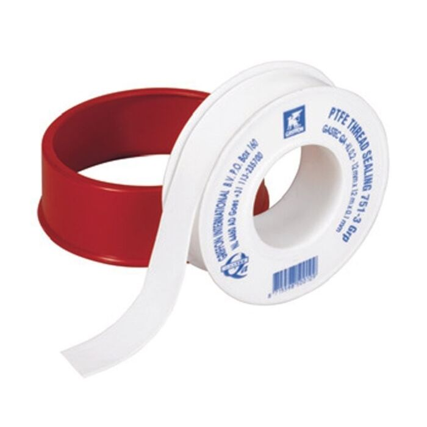

**⚠️ Teflon — paste or tape, never both.** Together, the tape adds dimension to the threads
while the paste acts as a lubricant; the installer can then unintentionally drive the male
adapter in too far and **split the valve body**.
- Paste: fills the voids between threads. Hand-tighten the nipple into the valve, then ~¼ turn
  more with a wrench.
- Tape: wrap the pipe three full times. Hand-tighten, then ~½ turn more with a wrench.

So teflon lands only on the male threads that screw into the valve's two female ports;
the swivel-nut inlet and the compression-nut outlet of this system stay bare (see the rule at the
top of this section). The outlet adapter is a **PE compression × male-thread** fitting — the
compression end must match the hose OD (25 mm here). This is the genuinely useful fitting for the
poly side, distinct from the male × male double nipple that joins the manifold to the inlet.

**⚠️ Never use the solenoid or flow control as a grip handle** when tightening a nipple — you will
damage them; hand-tight only on the solenoid.

**⚠️ Use waterproof wire connectors** for the solenoid-to-field-wire joints in the valve box.
Non-waterproof connections corrode, which raises electrical resistance; high resistance can
blow fuses or trip the controller. (Wire gauge vs. run length: see `wiring.md`.)

The ⚠️-marked lines through this section are the install cautions — carry the marker into the
reply at the matching step, and don't drop it because a line reads like ordinary advice. Lead a
step with ⚠️ only; don't stack other severity markers on the same line.

## External leak (valve leaking to the outside)

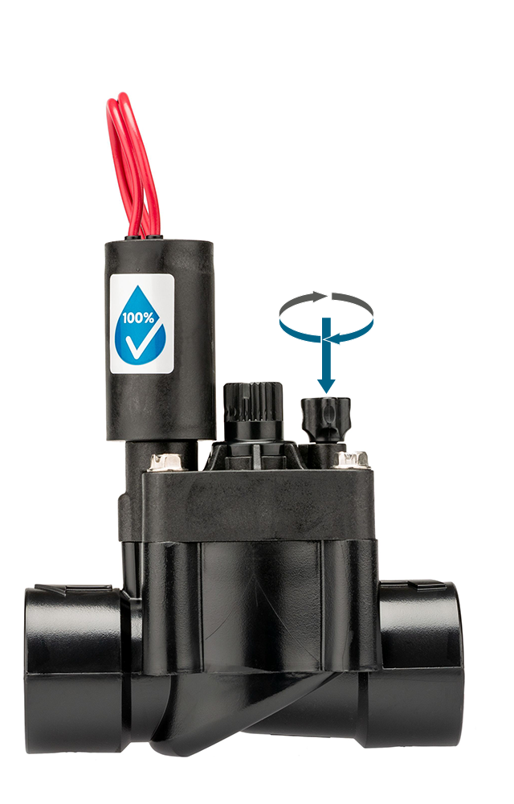

Run the checklist in cheapest-first order:

- **Bleed screw open or damaged** — hand-tighten clockwise.
- **Solenoid loose or turned on manually** — hand-tighten clockwise until snug.
- **Loose bonnet/body screws** — tighten until snug.
- **Diaphragm not seated correctly** — 🔍 remove the bonnet and inspect alignment (`valve-internals.md`).
- **Crack in the body** — requires valve replacement.

## Weeping / leaking when the system is OFF

There are two distinct causes, and the most common one is **not** the valve:

- **Low-head drainage (most common).** The lowest head on a zone lets water drain out of the
  hose after the valve closes. The tell: residual water stops once the hose has emptied,
  then stays dry. This is a head/hose issue, fixed with check valves (e.g. HCV) on heads or
  hoses — a check valve in the head will *not* fix a valve leak, and vice versa. See `heads.md`.
- **Water passing through the zone valve.** Usually debris holding the diaphragm off its seat,
  or a damaged diaphragm/seat. Disassemble, rinse all parts in clean water, reassemble; replace
  the diaphragm assembly if visibly damaged. See `valve-internals.md`.

Do not assume the valve. Decide which by whether the leak self-stops after the hose empties.

## Slow-closing valve

Designed to close within ~10–20 seconds of the solenoid de-energising. Slower than that almost
always means a restriction in the diaphragm metering port(s) — debris clogging the small holes
that meter water to the upper chamber, so the valve closes very slowly or stays open. Fix is to
replace the diaphragm assembly. Full detail in `valve-internals.md`.

## PGV body styles (identification)

The PGV family comes in several body styles. This whole-valve reference documents the **1" globe
with flow control (PGV-101G)** — the first one below. The others are shown so a body that doesn't
match can be ruled out during identification. Confirm which body is installed from `setup.yaml`.

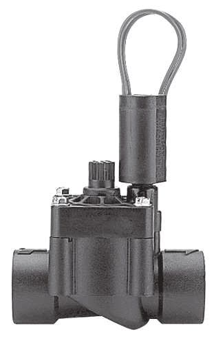

- **1" globe, flow control (PGV-101G).** Inlet and outlet inline; flow control knob
  and bleed on top. The reference above describes this body.
- **Angle (PGV-100A/101A).** Outlet exits at 90° from the bottom, so the valve can sit on top of a
  deep main line; lower pressure loss than globe. Flow-direction arrow on the body.

  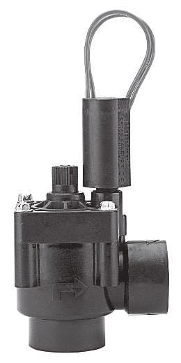

- **Male thread × barb (PGV-100MB).** Barbed outlet for poly-pipe hoses (common in cold-climate
  installs) — saves threading an adapter.

  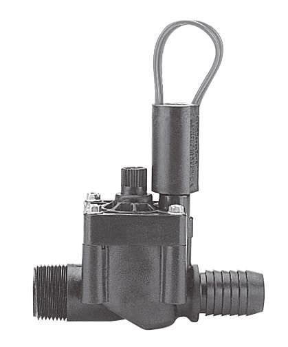

- **1½"/2" globe/angle (PGV-151/201).** Larger commercial bodies with a jar-top bonnet and a
  non-rising flow control handle; these are the sizes that accept the Accu-Set regulator.

  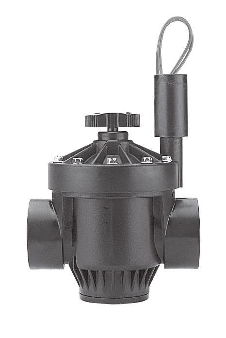

## Specifications (PGV)

Operating:
- Flow: 0.05 to 9 m³/h (0.7 to 150 l/min)
- Recommended pressure: 1.5 to 10 bar (150 to 1000 kPa)
- Maximum rated pressure: 10.3 bar — the ABS skirted bonnet holds this without softening
  in hot weather. Well within reach of typical residential pump pressures.
- Temperature rating: 66 °C
- Warranty: 2 years

Solenoid (summary — full detail in `valve-solenoid.md`):
- 24 VAC
- 350 mA inrush / 190 mA holding at 60 Hz
- 370 mA inrush / 210 mA holding at 50 Hz
- Coil resistance spec (Hunter PGV): 20–60 Ω

Pressure loss across the 1" PGV (Globe body; converted from
Hunter's flow/pressure source table):

| Flow (m³/h) | Flow (l/min) | Loss (bar) |
|---|---|---|
| 0.23 | 3.8 | 0.21 |
| 1.14 | 19 | 0.28 |
| 2.27 | 38 | 0.28 |
| 3.41 | 57 | 0.34 |
| 4.54 | 76 | 0.34 |
| 5.68 | 95 | 0.41 |
| 6.81 | 114 | 0.55 |
| 9.08 | 151 | 0.97 |

At a typical per-zone flow of ~2.2 m³/h (≈37 l/min), each zone valve costs ~0.28 bar of
the available pump head — useful when budgeting pressure for the heads downstream. (See the
hydraulics tool / `setup.yaml` for this system's actual per-zone flows.)

## Filter / mesh (PGV 1")

The PGV 1" filter screen sits **on the diaphragm**. The screen is specified by its opening size in
mm/micron below; the "US mesh equivalent" column is a cross-reference to the US screen-mesh standard
only (mesh number = openings per 25.4 mm; higher number = finer screen). Use the metric figures.

| Model | Opening | Micron | US mesh equiv. (ref) | Location |
|---|---|---|---|---|
| PGV 1" (and ASV ¾"/1") | 0.254 mm × 0.482 mm rectangular | 484 | 36 | on diaphragm |

When servicing, this is the screen to clean of grit; on well-fed systems this is routine.

## Replacement parts (PGV-101G — 1" globe, NPT, with flow control)

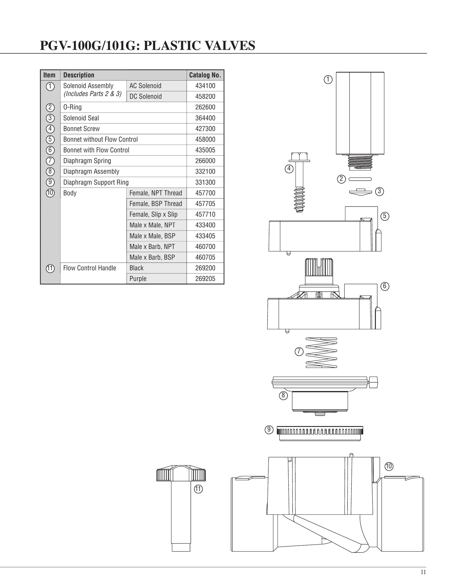

The parts the homeowner can actually swap, with Hunter catalog numbers:

| Part | Catalog No. |
|---|---|
| Solenoid assembly (incl. O-ring + seal) | 434100 |
| Solenoid O-ring | 262600 |
| Solenoid seal | 364400 |
| Bonnet screw | 427300 |
| Bonnet — with flow control | 435005 |
| Diaphragm spring | 266000 |
| Diaphragm assembly | 332100 |
| Diaphragm support ring | 331300 |
| Body — female, NPT thread | 457700 |
| Flow control handle — black | 269200 |

The solenoid (434100) and the diaphragm assembly (332100) are the two parts that actually fail in
service — see `valve-solenoid.md` and `valve-internals.md` for when to replace each.

## See also
- `valve-internals.md` — diaphragm, spring, seat, support ring, metering ports, disassembly.
- `valve-solenoid.md` — coil, plunger, exhaust/entry ports, voltage and resistance tests.
- `wiring.md` — wire gauge/run, waterproof connectors, swap-wire and continuity tests.
- `controller.md` — voltage at controller terminals.
- `hoses.md` — zone-wide weakness from a punctured hose (the alternative cause to a partly-open valve diaphragm when one zone is weak).
- `heads.md` — *Pairing MP ↔ PRS40* for the at-the-head regulation tier; *Misting from the MP on top* for the symptom that may suggest moving to per-valve Accusync.
